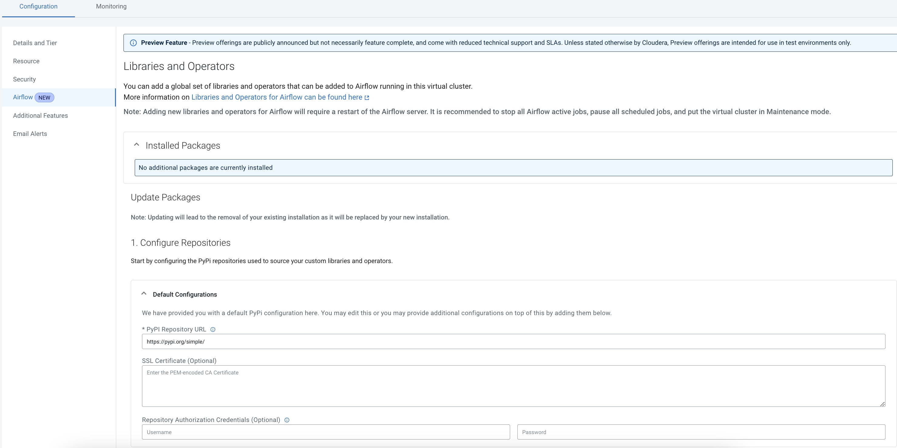

# Creating Custom Airflow Operators and using them in CDE 
## Purpose
Building Custom Operators help Data engineers abstract and reuse code across workloads. Example use cases could be some custom logic that can be wrapped around Airflow tasks that needs to be executed. In this example, we will create a custom arithmetic operator that will do some arithmetic operations as a part of our pipeline

## Instructions
There are 2 parts here, in part1 we will understand how to create custom operators and upload them to a pypi mirror. In part 2 we will use these operators in CDE 
### Pre-requisites : 
- You will need to create an account in [https://test.pypi.org/](https://test.pypi.org/)
- You will need to create and use API tokens to authenticate and upload your package. Refer to pypi.org documentation on using API tokens [here](https://test.pypi.org/help/#apitoken)
### Part 1 : Creating a python package with a new Custom Airflow Operator
- Clone this repository in your local folder
- change current directory to the folder cde_custom_airflowoperator 
``` 
cd your-path/cde_custom_airflowoperator  
``` 

-  Next we need to create custom python library with our operator. We are going create a python package out our custom DAG. Review the Airflow DAG in src/arithmetic_operator.py. This DAG extends the Airflow baseoperator to create a new custom operator called ArithmeticOperator. The operator performs arithmetic operations on 2 numbers based on the type of operation specified in the parameter.
- Finally, let us create our python package and deploy it to a test pypi mirror. The easiest way to do so, is to follow step by step instructions in the link provided by python.org [here](!https://packaging.python.org/en/latest/tutorials/packaging-projects/). Do not forget to create an testpypi account and authentication with API tokens as mentioned in the pre-requisites. 
- Once have uploaded this operator following the instructions mentioned earlier, you should be able to see the package as below. 


### Part 2: Using our Custom Airflow Operator in an Airflow Job

**CDE SETUP**:

First we need set up our airflow environment in CDE to fetch the custom operator build file. Select the Airflow configuration tab by first clicking on the cluster details as shown below


Next use the airflow configuration tab shown below to set up the CDE Airflow environment with your custom operator as follows

- change the Pypi repository URL to https://test.pypi.org ( or any other pypi mirror repo that you have used for uploading your python package). if you have used testpypi for your custom airflow operator keep other fields blank and click on validate configutations
- now you need to add a single requirements.txt in step 2 i.e. the Build stage. Modify the requirements.txt in the CDE_setup folder to use the package name that you have used for your custom operator
- you should see the package getting built as shown below.

- once succesfully built you should be able to see the package installed as shown below. Your version number may vary based on what you have used during package build


- Finally click on the Activate button to activate the package in the airflow experience. 

**Using Custom Operators**
Now let us create a new CDE Job and run it. Let us use the CDE User Interface to create a new airflow job which uses this operator. Use the dag file Dag1.py in the folder CDE_Setup to upload for this job. Click on create and run to execute the job


Let us validate by checking the Airflow UI within CDE. As shown below the job has executed succesfully


Finally,  let us open one of the logs to check the execution of the addition task of the job 

## Summary
Here is a summary of the learning goals we have reached through this example: 
- Building Custom Airflow Operators
- Setup the airflow environment in Cloudera Data Engineering
- Deployed an airflow DAG that uses our custom operator
